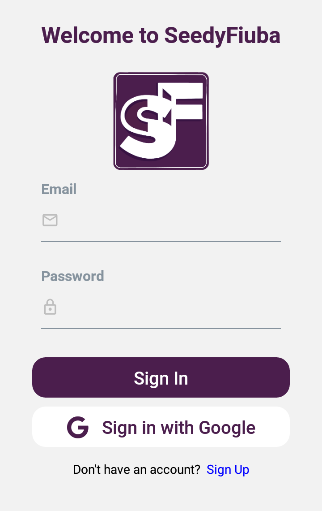
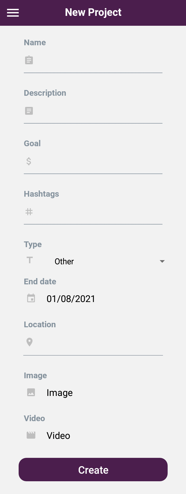

# App Mobile Guia de Usuarios
El siguiente documento busca explicar a nuevos los usuarios el funcionamiento de la aplicacion para mobiles.

## Tabla de Contenidos
1. [Registro](#registro)
2. [Inicio de Sesion](#inicio-de-sesion)
3. [Pantalla de Inicio](#pantalla-de-inicio)
4. [Menu](#menu)
5. [Visualizacion del Proyecto](#visualizacion-del-proyecto)
6. [Creacion de Proyectos](#creacion-de-proyectos)
7. [Edicion de Proyectos](#edicion-de-proyectos)
8. [Perfil de usuario](#perfil-de-usuario)
8. [Editar perfil de usuario](#editar-perfil-de-usuario)

## Registro e Inicio de Sesion

Para comenzar a interactuar con la plataforma necesita registrase en la misma,
para eso presionamos el texto "Sign Up".

Lo anterior abrira una nueva ventana donde completara todos sus datos. 

Una vez hecho esto presionamos el boton "Sign Up" si el registro fue existoso podra hacer 
uso de la plataforma.

Si ya tenemos una cuenta, llenamos los datos solicitados y presionamos "Sign In",
Tambien podemos iniciar sesion utilizando nuestra cuenta de Google.

Si el inicio de sesion fue exitoso podra hacer uso de la plataforma.

## Pantalla de Inicio

Despues de iniciar sesion o registrarse la pantalla principal mostrara todos los proyectos
que se encuentran disponibles en la plataforma

## Menu

Tendra disponible un menu, que lo ayudara a navegar por las distintas pantallas de la
aplicacion, para acceder a este menu solo presione el boton de hamburguesa

* **Main:** Podremos ver todos los proyectos de la plataforma
* **Account:** Veremos toda la informacion de usuario, esto incluye sus datos personales e 
    informacion de su billetera
* **My Projects:** Podremos ver todos los proyectos que el usuario creo
* **Create Project:** Permite crear nuevos proyectos
* **Favorite Project:** Podremos ver todos los proyectos que el usuario marco como favoritos
* **Inbox:** Podremos ver todos los mensajes que recibio el usuario
* **Seer:** Podremos ver todos los proyectos en el cual el usuario es veedor
* **My Transactions:** Muestra las distintas trasacciones que el usuario realiza con su billetera
* **Sign Out:**  Permite al usuario cerrar la sesion actual

## Proyectos

### Visualizacion del Proyecto

Presionando cualquier proyecto en la pantalla principal, observaremos todos los
datos del mismo.

Dentro de esta pantalla tendra los siguiente campos con los que podra interactuar

* **Calificar Proyecto:**  El usuario podra calificar un proyecto asignandole una cantidad de estrellas,
esta cantidad estara entre 1 a 5 cinco estrellas.

  

* **Agregar como Favorito:** Presionando el corazon el usuario marcara el proyecto como 
favorito.

  

#### Comentar Proyecto

Presionar el boton "Comments" nos redirige a una nueva pantalla donde podremos agregar 
comentarios al proyecto

Una vez que se envio el comentario la pantalla se actualizara y mostrara su comentario.

#### Apoyar Proyecto

Presionar el boton "Support" lanzara una ventana emergente que le permite agregar el 
monto con el cual quiere apoyar el proyecto.

Recibira una alerta con el estado del mismo una vez que se envie el monto deseado.

### Visualizacion del Proyecto Propio

Presionando cualquier proyecto en la pantalla **My Projects**, veremos los mismos campos
de la anterior seccion a excepcion de los botones "Support" y "Comments" estas seran reemplados
por el boton "Add Seer" y se agrega un boton en la barra de direccion que permite la edicion del proyecto

#### Editar Proyecto

Presionando el boton de edicion de proyecto, se abrira una ventana emergente que te permitira modificar
los siguientes campos "Hashtags", "Nombre" y "Descripcion"

Una vez editado cualquier campo presione el boton "Update" , si fue correcta la edicion recibira una alerta
informando el estado del mismo.

#### Agregar Veedor

Al precionar el boton "Add Seer" abrira una ventana emergente que le permitira agregar a otro usuario como
veedor de su proyecto. 

Una vez que agrego el id del usuario y apreto el boton "Invite" recibira una alerta informando el estado del mismo

### Visualizacion del Proyecto como Veedor

Presionando cualquier proyecto en la pantalla **Seer**, veremos los mismos campos
de la anterior seccion a excepcion del boton "Add Seer" que sera reemplado por otros campos que le permitiran 
al usuario como veedor poder liberar los fondos de las distintas etapas de un proyecto.

Por cada etapa aceptada recibira una alerta informando el estado del mismo, Al aceptar una etapa las anteriores
sera aceptadas automaticamente

### Creacion de Proyectos

Para crear un proyecto vamos a **Create Project** y observaremos el siguiente formulario

#### Algunos Campos
* **Goal:** La meta propuesta puede ser divida en etapas, para poder difinir una nueva etapa
simplemente agregue un guion (-) para separar los distintos montos de cada etapa.
* **End Date:** La fecha minima de finalizacion de un proyecto es de 8 dias.
* **Image y Video:** Estos campos son mostrados en la portada de su proyecto, no son obligatorios pero son de mucha ayuda
para traer inversores.

Una vez que completaron todos los campos y presiono "Create" recibira una alerta que mostrar
si el proyecto fue creado o no.

Si fue creado correctamente podra dirigirse a las seccion **My Projects** donde vera su proyecto.

### Busqueda de Proyecto

Presionando la "lupa" en la pantalla principal, nos redirige a una nueva pantalla de busqueda
en esta pantalla podremos buscar por titulo ademas de poder aplicar distintos filtros.

#### Filtros de Busqueda

Para facilitar la busqueda de proyectos, tenemos los siguientes filtros:

* **Type:** Se busca por los distintos tipos de proyectos que estan disponibles en la plataforma
* **Location:** Se busca a partir de la latitud y longitud de la ubicacion del proyecto
* **Hashtags:** Se busca a partir de los hashtags que tienen los proyectos

### Consulta Privadas

#### Enviar Mensaje

Para enviar un mensaje a otro usuario tendra que dirigirse a su perfil, ahi encontrara en la barra de
direcciones un boton que le permitira enviar un mensaje

Esto abrira una ventana emergente donde podra colocar su mensaje

Una vez enviado el mensaje recibira una alerta con el estado de la misma

#### Recibir Mensaje

Sera notificado cuando reciba un nuevo mensaje.

Si presiona la notificacion sera redirigido a la pantalla de "Inbox" donde se encontraran todos
los mensajes que recibio, ademas podra responder cualquier mensaje

### Perfil de usuario
#### Propio
Para visualizar nuestro perfil de usuario vamos a **Account** y observaremos la siguiente pantalla:

##### Billetera

Si deslizamos la pantalla hacia la izquierda, podremos ver la información asociada a nuestra billetera:

Los campos **address** y **privateKey** pueden copiarse clickeando los mismos.

El boton `(+)` nos abrirá nuestro buscador web por defecto y nos redirigirá a una página donde podremos cargar saldo a partir de la **address** de nuestra billetera.

Una vez introducida nuestra nuestra **address**, completado el _captcha_ y clickeando en el boton `Send me 0.1 Test ETH`, podremos volver a la aplicación y refrescar la vista de nuestra billetera (deslizando la pantalla hacia abajo) para visualizar nuestro nuevo saldo.

#### Emprendedor
Tambien puedes visualizar el perfil de otros emprendedores clickeando el nombre que se encuentra al lado del campo **created by** en la vista de uno de sus proyectos. 

En este caso, la información asociada a su billetera estará oculta.

### Editar perfil de usuario
Para editar nuestro perfil clickeamos en el `lapiz` que se encuentra en la esquina superior derecha de la vista de nuestro perfil. Entonces veremos el siguiente formulario modificable:

El campo **Email** no puede ser actualizado con un email ya existente en el sistema.

### Transacciones
Para ver la historia de nuestros patrocinios vamos a **My Transactions**.

El campo **State** puede tomar los siguientes valores:
- `Done`:  La transacción fue exitosa.
- `Mining`: La transacción aún se esta minando.
- `Failed`: La transacción fallo por un error inesperado.
- `Not enough balance`: La transacción fallo porque nuestra billetera no tenia suficientes fondos para cubrir el costo total de la transacción.
